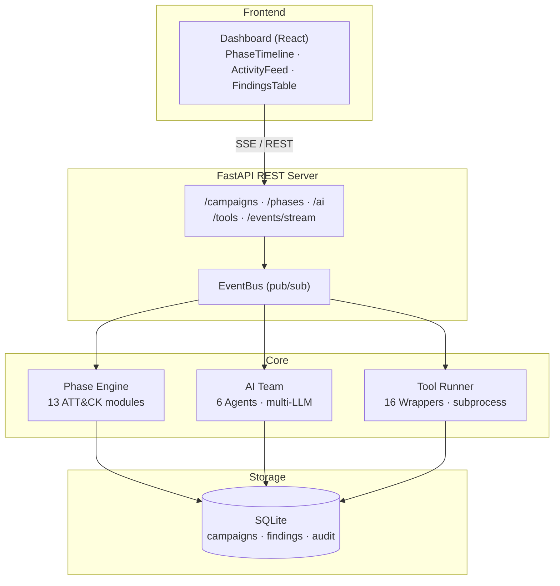
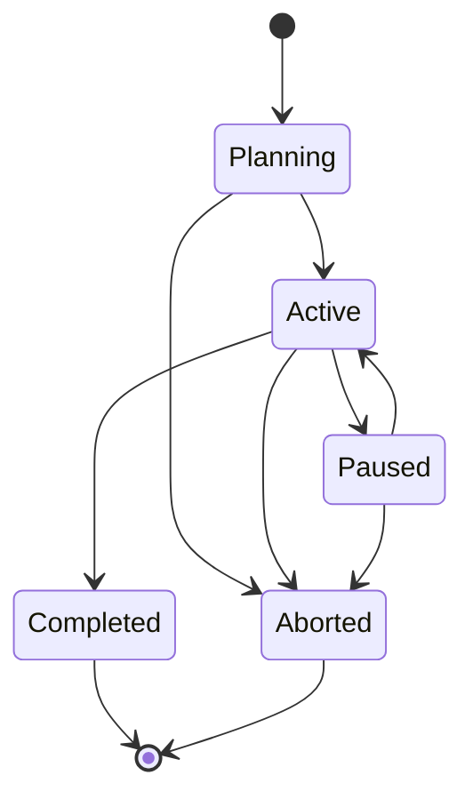
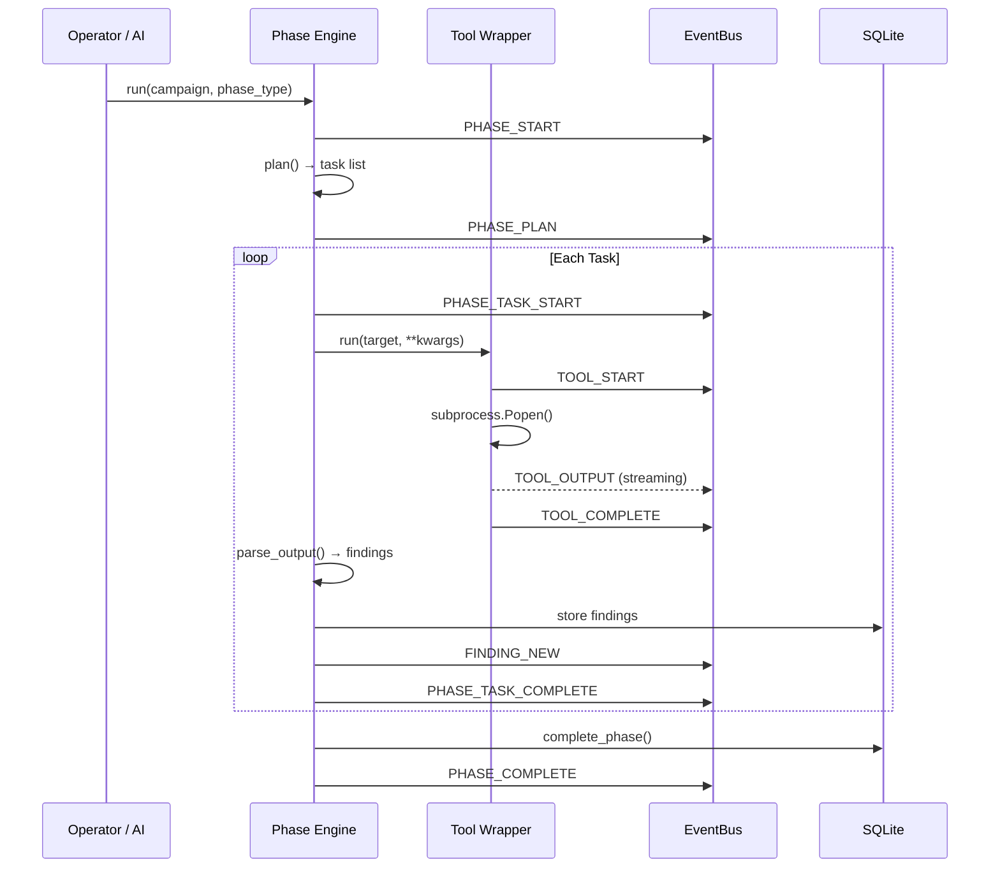

# ice_9


**Red Team Orchestration Platform — MITRE ATT&CK-Aligned Campaign Management**


---

## Overview

**ice_9** is a red team orchestration platform that manages the full lifecycle of a penetration testing engagement — from reconnaissance through impact. It maps every operation to the MITRE ATT&CK framework, integrates 16 offensive tools under a unified interface, and orchestrates a multi-agent AI team that can plan engagements, analyse results, and execute phases autonomously.

Instead of running tools manually and tracking findings in spreadsheets, ice_9 provides a campaign database, structured phase execution, automated finding extraction, and a real-time web dashboard with live event streaming.

---

## Architecture



### Campaign State Machine



### Phase Execution Flow



---

## Installation

### Quick Start

```bash
git clone https://github.com/b-3llum/ice-9
cd ice-9
./install.sh
```

The installer will:
1. Create a Python virtual environment and install ice_9
2. Install dashboard npm dependencies (if Node.js is available)
3. Auto-detect your Python, Node.js, Go, and tool paths
4. Generate systemd service files tailored to your environment
5. Optionally install and enable the API + dashboard as system services

After installation, the CLI is available immediately:

```bash
source .venv/bin/activate
ice9 --help
```

If you installed the systemd services, the API and dashboard are already running:
- **API:** http://localhost:8443
- **Dashboard:** http://localhost:3000

### Prerequisites

- **Python 3.10+** — required
- **Node.js 18+** — required for the web dashboard (optional if CLI-only)
- **Ollama** — default LLM provider (or set API keys for Claude/OpenAI/Groq)
- **Offensive tools** — install the ones you need (see below)
- **Supported platforms:** Linux (systemd) and macOS (launchd)

### Installing Offensive Tools

ice_9 integrates 16 tools. Install the ones relevant to your engagement — missing tools won't break anything, phases will skip unavailable tools.

**System packages:**

```bash
# Arch
sudo pacman -S nmap metasploit

# Debian/Ubuntu
sudo apt install nmap metasploit-framework

# macOS (Homebrew)
brew install nmap
brew install --cask metasploit
```

**Go tools:**

```bash
go install github.com/projectdiscovery/nuclei/v3/cmd/nuclei@latest
go install github.com/owasp-amass/amass/v4/...@master
go install github.com/projectdiscovery/subfinder/v2/cmd/subfinder@latest
```

**pip tools (install into the project venv):**

```bash
source .venv/bin/activate
pip install bloodhound impacket
pip install "theHarvester @ git+https://github.com/laramies/theHarvester.git"
```

> **Warning:** Do not `pip install Responder` — the PyPI package is a web framework, not the LLMNR poisoner. Clone the real one instead.

**Manual installs:**

```bash
# netexec (crackmapexec successor)
# On Arch: yay -S netexec
# Or: pip install netexec  (requires Python <3.14)

# Responder — clone from GitHub
sudo git clone https://github.com/lgandx/Responder /opt/Responder
```

**Verify all tools:**

```bash
ice9 tool list
```

All detected tools show as `yes` in the Available column. ice_9 automatically searches your venv, `~/go/bin`, and `~/.local/bin` in addition to the system PATH.

### macOS Notes

The CLI, API, dashboard, and AI agents all work on macOS. Some offensive tools have limited macOS support:
- **Responder** — requires Linux raw sockets, does not run on macOS
- **netexec** — limited macOS support
- For full tool coverage, run ice_9 on a Linux host or VM

### Installer Options

```bash
./install.sh --no-services    # skip service setup (systemd/launchd)
./install.sh --no-dashboard   # skip Node.js/dashboard setup
```

---

## Services

ice_9 ships with `ice9-services` to manage the API and dashboard. It auto-detects your platform and uses systemd (Linux) or launchd (macOS).

```bash
./ice9-services status      # show service status and URLs
./ice9-services start       # start API + dashboard
./ice9-services stop        # stop all
./ice9-services restart     # restart all
./ice9-services logs        # tail all logs
./ice9-services logs ice9-api   # tail API logs only
./ice9-services install     # install service files (systemd/launchd)
./ice9-services uninstall   # remove service files
./ice9-services enable      # auto-start on boot/login
./ice9-services disable     # disable auto-start
```

If you skipped services during `./install.sh`, you can run manually:

```bash
# Terminal 1 — API
source .venv/bin/activate
uvicorn ice_9.api:app --host 0.0.0.0 --port 8443

# Terminal 2 — Dashboard
cd dashboard
npm run dev
```

---

## Configuration

ice_9 loads configuration from the first file found:

1. `./config/ice9.yaml`
2. `./ice9.yaml`
3. `~/.ice9/config.yaml`

```yaml
# config/ice9.yaml
data_dir: ~/.ice9

# Extra directories to search for tool binaries
tool_paths:
  - ~/.local/bin
  - /opt/impacket/bin

# LLM providers
providers:
  ollama:
    base_url: "http://localhost:11434"
    model: "llama3.2:3b"
  # claude:
  #   api_key: "${ANTHROPIC_API_KEY}"
  #   model: "claude-sonnet-4-6-20250514"
  # openai:
  #   api_key: "${OPENAI_API_KEY}"
  #   model: "gpt-4o"

# Agent role assignments
agents:
  coordinator:
    provider: ollama
    model: "llama3.2:3b"
  recon_analyst:
    provider: ollama
  exploit_researcher:
    provider: ollama
  report_writer:
    provider: ollama
```

Environment variables are resolved with `${VAR_NAME}` syntax in YAML values.

### Environment Variables

| Variable | Purpose | Default |
|---|---|---|
| `ICE9_API_KEY` | REST API authentication key | none (open) |
| `ICE9_CORS_ORIGINS` | Allowed CORS origins | `*` |
| `ICE9_HOME` | Data directory override | `~/.ice9` |
| `ANTHROPIC_API_KEY` | Claude API key | — |
| `OPENAI_API_KEY` | OpenAI API key | — |
| `GROQ_API_KEY` | Groq API key | — |

Create a `.env` file in the project root to set these (loaded automatically by the systemd services).

---

## Usage

### Campaign Lifecycle

```bash
# Create a campaign with scope targets
ice9 campaign create -n "Corp Pentest" -s "10.10.10.0/24" "corp.local" --client "ACME Corp" --lead "operator"

# List campaigns
ice9 campaign list

# Show campaign detail — phases, findings, progress
ice9 campaign show <id>

# State transitions
ice9 campaign activate <id>
ice9 campaign pause <id>
ice9 campaign resume <id>
ice9 campaign complete <id>
ice9 campaign abort <id>

# Delete a campaign (supports short ID prefixes)
ice9 campaign delete <id>
```

### Phase Execution

```bash
# Run a single phase (by name or ATT&CK ID)
ice9 phase run <id> recon
ice9 phase run <id> credential_access
ice9 phase run <id> TA0007

# List phase status
ice9 phase list <id>

# Skip a phase
ice9 phase skip <id> resource_dev
```

### Tool Execution

```bash
# List all tools and availability
ice9 tool list

# Run a tool directly against a target
ice9 tool run nmap --target 10.10.10.0/24 --campaign <id>

# Register a custom tool
ice9 tool add --name mytool --binary /path/to/tool --desc "description" --attck T1234
```

### AI Operations

```bash
# AI engagement plan
ice9 team plan <id>

# Ask a specific agent
ice9 team ask "analyze these nmap results" --agent recon_analyst --campaign <id>

# Run full AI team analysis
ice9 team run <id> --prompt "what attack paths exist?"

# Show agent status
ice9 team status

# Full autopilot — AI selects and executes up to 5 phases
ice9 campaign auto <id> --max 5
```

### Reporting

```bash
# Generate DOCX penetration test report
ice9 report generate <id>
ice9 report generate <id> --output report.docx --ai-summary --ai-narrative
```

### Audit Log

```bash
ice9 audit show --limit 50 --campaign <id>
```

---

## Integrated Tools

    nmap               Network scanner — host discovery, port scanning, service detection
    nuclei             Template-based vulnerability scanner
    kerb-map           Kerberos attack surface mapper — SPNs, AS-REP, delegation, encryption
    bloodhound         AD attack path analysis via bloodhound-python
    crackmapexec       Credential spraying, share enumeration, command execution
    metasploit         Exploitation framework — module execution, session management
    secretsdump        Extract SAM, LSA secrets, cached creds, NTDS.dit
    getnpusers         AS-REP roasting — TGTs for accounts without pre-auth
    getuserspns        Kerberoasting — TGS tickets for service accounts
    psexec             Remote command execution via SMB
    wmiexec            Remote command execution via WMI
    ntlmrelayx         NTLM relay attack framework
    theharvester       OSINT — email, subdomain, host harvesting
    amass              Attack surface mapping and subdomain enumeration
    subfinder          Passive subdomain discovery via multiple sources
    responder          LLMNR/NBT-NS/MDNS poisoner — capture Net-NTLM hashes

Tools are detected automatically. ice_9 searches the project venv, `~/go/bin`, `~/.local/bin`, and the system `$PATH`. Additional search paths can be configured with `tool_paths` in `ice9.yaml`.

---

## ATT&CK Phase Modules

ice_9 maps every operation to a MITRE ATT&CK tactic. Each phase module knows which tools to run, how to plan tasks against the campaign scope, and how to extract findings from tool output.

| Phase | ATT&CK ID | Primary Tools |
|---|---|---|
| Reconnaissance | TA0043 | nmap, nuclei, theharvester, amass, subfinder |
| Resource Development | TA0042 | metasploit |
| Initial Access | TA0001 | nuclei, metasploit |
| Execution | TA0002 | psexec, wmiexec, metasploit |
| Persistence | TA0003 | metasploit |
| Privilege Escalation | TA0004 | metasploit, crackmapexec |
| Defense Evasion | TA0005 | metasploit |
| Credential Access | TA0006 | kerb-map, secretsdump, getnpusers, getuserspns, responder |
| Discovery | TA0007 | bloodhound, crackmapexec, nmap |
| Lateral Movement | TA0008 | psexec, wmiexec, crackmapexec, ntlmrelayx |
| Collection | TA0009 | crackmapexec |
| Exfiltration | TA0010 | — |
| Impact | TA0040 | metasploit |

---

## AI Agent Team

ice_9 orchestrates a multi-agent AI team. Each agent has a specialised role and system prompt. Agents run in parallel, results are synthesised by the coordinator.

| Agent | Role |
|---|---|
| **Coordinator** | Red team lead — plans engagements, assigns tasks, synthesises results |
| **Recon Analyst** | Analyses scan data, maps attack surfaces, prioritises targets |
| **Exploit Researcher** | Researches CVEs, assesses exploitability, suggests attack vectors |
| **Social Engineer** | Profiles organisations, recommends phishing/pretexting scenarios |
| **Report Writer** | Drafts findings with severity ratings and remediation guidance |
| **Code Analyst** | Reviews source code for OWASP Top 10 and CWE issues |

**Supported LLM providers:** Ollama (local, default), Anthropic Claude, OpenAI, Groq, Mistral. Provider fallback chains are supported — if one provider fails, the next is tried automatically.

**Autopilot mode** (`ice9 campaign auto`) lets the AI coordinator select and execute phases iteratively, producing a full engagement with zero manual intervention.

---

## Real-Time Events

ice_9 emits structured events for every operation via an in-process event bus. The API exposes these as Server-Sent Events for live dashboard updates.

| Event | Description |
|---|---|
| `tool_start` | Tool binary launched with target and args |
| `tool_output` | Batched stdout lines from running tool |
| `tool_complete` | Tool finished — duration, return code |
| `tool_error` | Tool failed — error message |
| `phase_start` | Phase execution began |
| `phase_plan` | AI generated task plan for phase |
| `phase_task_start` | Individual task within phase started |
| `phase_task_complete` | Task finished — success/failure, duration |
| `phase_complete` | Phase execution finished |
| `ai_request` | LLM request sent to provider |
| `ai_chunk` | Streaming token from LLM |
| `ai_response` | Complete LLM response received |
| `auto_phase_select` | Autopilot AI selected next phase |
| `auto_complete` | Autopilot run finished |
| `finding_new` | New vulnerability finding created |

```bash
# Subscribe to live events
curl -N http://localhost:8443/events/stream?campaign_id=<id>

# Get recent event history
curl http://localhost:8443/events/recent?limit=50
```

---

## API Endpoints

All endpoints accept and return JSON. Authenticate with `X-API-Key` header when `ICE9_API_KEY` is set.

| Method | Endpoint | Description |
|---|---|---|
| GET | `/health` | Health check |
| POST | `/campaigns` | Create campaign |
| GET | `/campaigns` | List campaigns |
| GET | `/campaigns/{id}` | Campaign detail |
| PUT | `/campaigns/{id}/status` | Transition status |
| DELETE | `/campaigns/{id}` | Delete campaign |
| POST | `/campaigns/{id}/phases/{phase}/run` | Execute phase (live events) |
| GET | `/campaigns/{id}/phases/running` | Check running phase |
| GET | `/campaigns/{id}/phases/{phase}/tasks` | List phase tasks |
| GET | `/campaigns/{id}/phases/{phase}/findings` | List phase findings |
| GET | `/campaigns/{id}/findings` | List all findings |
| POST | `/campaigns/{id}/findings` | Create finding |
| POST | `/campaigns/{id}/ai/plan` | AI engagement plan |
| POST | `/campaigns/{id}/ai/analyze` | Multi-agent analysis |
| POST | `/campaigns/{id}/ai/ask` | Query specific agent |
| POST | `/campaigns/{id}/ai/auto` | AI autopilot |
| GET | `/tools` | List tools + availability |
| GET | `/ai/agents` | List AI agents |
| GET | `/ai/providers` | List LLM providers |
| GET | `/events/stream` | SSE event stream |
| GET | `/events/recent` | Event history buffer |
| GET | `/audit` | Audit log entries |

---

## Reporting

ice_9 generates structured DOCX penetration test reports with:

- Executive summary (AI-generated)
- Scope and methodology
- Findings table with severity breakdown (Critical / High / Medium / Low / Info)
- Detailed finding descriptions with evidence and remediation
- ATT&CK technique mapping
- AI-generated attack narrative

```bash
ice9 report generate <id> --ai-summary --ai-narrative --output report.docx
```

---

## Troubleshooting

| Problem | Fix |
|---|---|
| Tools show as MISSING | Install the tool, or add its directory to `tool_paths` in `ice9.yaml`. ice_9 auto-searches venv, `~/go/bin`, `~/.local/bin` |
| `address already in use` on port 8443 | Kill the old process: `kill $(lsof -ti:8443)` then restart |
| Dashboard shows stale data | Restart the API: `./ice9-services restart` |
| `ice9: command not found` | Activate the venv: `source .venv/bin/activate` |
| systemd service fails | Check logs: `journalctl -u ice9-api -n 30` |
| npx not found in service | install.sh auto-detects nvm/fnm paths. Re-run `./install.sh` |
| AI agents return errors | Start Ollama and pull the model: `ollama pull llama3.2:3b` |
| `pip install Responder` installed wrong package | That's a web framework. Uninstall it. Clone from `github.com/lgandx/Responder` |
| `pip install theHarvester` gives 0.0.1 | PyPI placeholder. Install from git: `pip install "theHarvester @ git+https://github.com/laramies/theHarvester.git"` |
| netexec won't build | Python 3.14 incompatible. Install via system package manager |

---

## Project Structure

```
ice_9/
├── ai/
│   ├── agents.py          # Agent definitions, roles, system prompts
│   ├── llm.py             # Multi-provider LLM client (Ollama, Claude, OpenAI, Groq, Mistral)
│   ├── orchestrator.py    # Campaign autopilot — AI phase selection
│   ├── providers.py       # Provider registry and fallback chains
│   └── team.py            # Multi-agent parallel orchestration
├── config/
│   └── settings.py        # YAML config loading, path resolution, tool_paths
├── core/
│   ├── audit.py           # Audit logging
│   ├── campaign.py        # Campaign lifecycle operations
│   ├── events.py          # EventBus singleton — real-time observability
│   ├── models.py          # Pydantic models — Campaign, Phase, Task, Finding
│   └── state.py           # State machine validation
├── db/
│   └── store.py           # SQLite persistence (WAL mode, cascade deletes)
├── phases/
│   ├── base.py            # PhaseModule base class
│   ├── recon.py           # TA0043 — Reconnaissance
│   ├── credential_access.py # TA0006 — Credential Access
│   ├── lateral_movement.py  # TA0008 — Lateral Movement
│   └── ...                # 13 phase modules total
├── tools/
│   ├── base.py            # ToolWrapper + resolve_binary() — smart path detection
│   ├── nmap.py            # Network scanner integration
│   ├── kerb_map.py        # kerb-map AD attack surface mapper
│   ├── impacket_tools.py  # Impacket suite (6 tools)
│   └── ...                # 16 tool wrappers total
├── reporting/
│   └── generator.py       # DOCX report generation
├── api.py                 # FastAPI REST + SSE endpoints
├── cli.py                 # Typer CLI commands
└── main.py                # Entry point

dashboard/                 # React/TypeScript web UI
├── src/
│   ├── api/               # Typed API client
│   ├── components/        # PhaseTimeline, ActivityFeed, FindingsTable, AIChat
│   ├── hooks/             # useEventStream (SSE), React Query
│   └── types/             # TypeScript interfaces
└── vite.config.ts

deploy/                    # Deployment files
├── gunicorn.conf.py       # Production WSGI config
└── README.md              # Production deployment guide

install.sh                 # One-command setup script
ice9-services              # Service management wrapper
```

---

## Production Deployment

See [deploy/README.md](deploy/README.md) for production setup with dedicated service users, TLS, and firewall configuration.

---

## Legal

ice_9 is designed exclusively for use in **authorised** penetration testing engagements and red team operations where written permission has been obtained from the system owner.

Use against systems for which you do not have explicit written authorisation is illegal under the Computer Fraud and Abuse Act (CFAA), the UK Computer Misuse Act, and equivalent legislation worldwide. The author assumes no liability for misuse.
