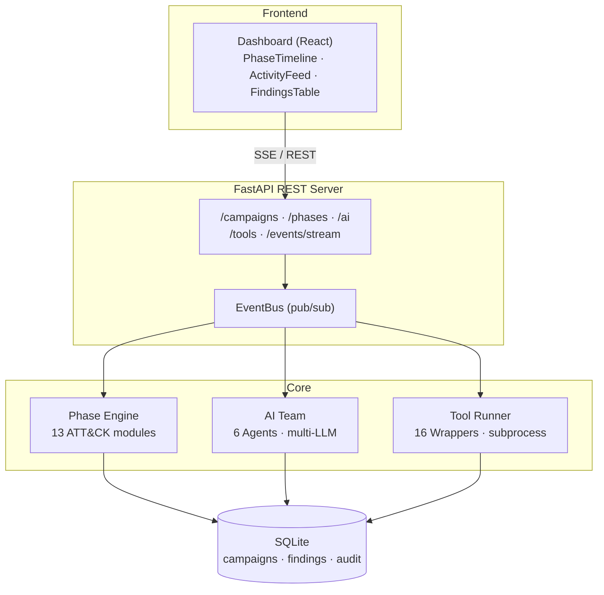

# ice_9


**Red Team Orchestration Platform — MITRE ATT&CK-Aligned Campaign Management**


---

## Overview

**ice_9** manages the full lifecycle of a red team engagement — from reconnaissance through impact — and maps every operation to the MITRE ATT&CK framework. It integrates 16 offensive tools under a unified interface and orchestrates a multi-agent AI team that can plan engagements, analyse results, and execute phases autonomously.

Instead of running tools by hand and tracking findings in spreadsheets, ice_9 provides a campaign database, structured phase execution, automated finding extraction, a REST API, and a real-time web dashboard with live event streaming.

---

## Architecture



Detailed state-machine and phase-execution sequence diagrams live in [`ice_9/docs/uml/`](ice_9/docs/uml).

---

## Installation

```bash
git clone https://github.com/b-3llum/ice-9
cd ice-9
./install.sh
```

The installer creates a Python venv and installs ice_9, sets up the dashboard (if Node.js is present), auto-detects your Python/Node/Go/tool paths, and optionally installs the API + dashboard as system services. Use `--no-services` or `--no-dashboard` to skip those steps.

```bash
source .venv/bin/activate
ice9 --help
```

With services installed, the **API** runs on http://localhost:8443 and the **dashboard** on http://localhost:3000.

### Prerequisites

- **Python 3.10+** (required)
- **Node.js 18+** — for the web dashboard (optional if CLI-only)
- **LLM** — Ollama (local default), a Claude subscription via the `claude` CLI, or API keys for Claude / OpenAI / Groq
- **Offensive tools** — install only the ones you need; missing tools are skipped, never fatal
- **Platforms:** Linux (systemd) and macOS (launchd)

### Installing offensive tools

ice_9 auto-detects binaries on `$PATH`, the venv, `~/go/bin`, and `~/.local/bin`; run `ice9 tool list` to see what's available. Install what your engagement needs:

```bash
# System packages — nmap, metasploit (pacman / apt / brew)
# Go tools     — nuclei, amass, subfinder (go install …@latest)
# pip (venv)   — bloodhound, impacket, theHarvester
```

A few gotchas:
- **Responder:** do *not* `pip install Responder` (that's an unrelated web framework). Clone https://github.com/lgandx/Responder.
- **theHarvester:** the PyPI package is a placeholder — install from git.
- **netexec:** requires Python <3.14; install via your system package manager.

On **macOS**, the CLI/API/dashboard/AI all work, but Responder (needs Linux raw sockets) and netexec have limited/no support — use a Linux host or VM for full tool coverage.

---

## Services

`ice9-services` manages the API and dashboard, using systemd (Linux) or launchd (macOS):

```bash
./ice9-services status | start | stop | restart | logs
./ice9-services install | uninstall | enable | disable
```

Or run them manually:

```bash
uvicorn ice_9.api:app --host 0.0.0.0 --port 8443   # API
cd dashboard && npm run dev                          # dashboard
```

---

## Configuration

Configuration is loaded from the first file found: `./config/ice9.yaml`, `./ice9.yaml`, or `~/.ice9/config.yaml`. `${VAR_NAME}` values are resolved from the environment.

```yaml
data_dir: ~/.ice9
tool_paths:              # extra dirs to search for tool binaries
  - ~/.local/bin
  - /opt/impacket/bin
providers:
  ollama:
    base_url: "http://localhost:11434"
    model: "llama3.2:3b"
  # claude:                          # metered API (needs a key)
  #   api_key: "${ANTHROPIC_API_KEY}"
  #   model: "claude-sonnet-4-6-20250514"
  # claude_cli:                      # subscription — uses the local `claude` CLI, no API key
  #   model: "sonnet"
agents:
  coordinator:
    provider: ollama
    model: "llama3.2:3b"
```

### Using a Claude subscription (no API key)

If you have the [`claude` CLI](https://claude.com/claude-code) installed and logged in, ice_9 can drive it directly with the `claude_cli` provider — your Claude subscription is used instead of a metered API key. Point any agent at it:

```yaml
providers:
  claude_cli:
    model: "sonnet"        # sonnet | opus | haiku, or a full model id
    # base_url: "/path/to/claude"   # optional: override the CLI binary path
agents:
  coordinator:
    provider: claude_cli
    model: "opus"
```

ice_9 invokes `claude --print` headlessly per request; the CLI must be on `PATH` (or set `base_url` to its path).

### Environment variables

| Variable | Purpose | Default |
|---|---|---|
| `ICE9_API_KEY` | REST API authentication key | none (open) |
| `ICE9_CORS_ORIGINS` | Allowed CORS origins | `*` |
| `ICE9_HOME` | Data directory override | `~/.ice9` |
| `ANTHROPIC_API_KEY` | Claude API key | — |
| `OPENAI_API_KEY` | OpenAI API key | — |
| `GROQ_API_KEY` | Groq API key | — |

Set these in a `.env` file in the project root (loaded automatically by the services).

### Running tools on a remote host (AWS/EC2)

By default tools run locally. Set an `ssh` execution backend to run every campaign tool on a remote host you control — e.g. an AWS EC2 attack box — so scans originate from that instance's IP and use the tooling installed there:

```yaml
execution:
  backend: ssh
  host: 1.2.3.4
  user: kali
  port: 22
  key_file: ~/.ssh/ice9.pem
```

ice_9 then wraps each tool as `ssh user@host '<tool …>'` (streaming and events are unchanged). You provision and manage the instance; it must have the offensive tools installed and be reachable over SSH with the given key.

> **Note:** tools that parse **stdout** (subfinder, theHarvester, nuclei, the impacket suite, crackmapexec, responder) work fully over SSH. Two tools (**nmap**, **amass**) write to a local temp file they parse afterward, so over SSH the raw output is still captured but their *structured* parsing isn't populated until the artifact is fetched back — a planned follow-up.

---

## Usage

```bash
# Campaign lifecycle
ice9 campaign create -n "Corp Pentest" -s "10.10.10.0/24" "corp.local" --client "ACME" --lead operator
ice9 campaign list
ice9 campaign show <id>
ice9 campaign activate | pause | resume | complete | abort | delete <id>

# Phases — by friendly name or ATT&CK ID
ice9 phase run <id> recon
ice9 phase list <id>
ice9 phase skip <id> resource_dev

# Tools
ice9 tool list
ice9 tool run nmap --target 10.10.10.0/24 --campaign <id>
ice9 tool add --name mytool --binary /path/to/tool --desc "…" --attck T1234

# AI team
ice9 team plan <id>
ice9 team ask "analyze these nmap results" --agent recon_analyst --campaign <id>
ice9 team run <id> --prompt "what attack paths exist?"
ice9 campaign auto <id> --max 5          # autopilot: AI selects & runs phases

# Reporting & audit
ice9 report generate <id> --ai-summary --ai-narrative --output report.docx
ice9 audit show --limit 50 --campaign <id>
```

---

## Integrated Tools

    nmap          Network scanner — host discovery, port/service detection
    nuclei        Template-based vulnerability scanner
    kerb-map      Kerberos attack surface — SPNs, AS-REP, delegation
    bloodhound    AD attack path analysis via bloodhound-python
    crackmapexec  Credential spraying, share enum, command execution
    metasploit    Exploitation — module execution, session management
    secretsdump   Extract SAM, LSA secrets, cached creds, NTDS.dit
    getnpusers    AS-REP roasting
    getuserspns   Kerberoasting
    psexec        Remote command execution via SMB
    wmiexec       Remote command execution via WMI
    ntlmrelayx    NTLM relay attack framework
    theharvester  OSINT — email, subdomain, host harvesting
    amass         Attack surface mapping and subdomain enumeration
    subfinder     Passive subdomain discovery
    responder     LLMNR/NBT-NS/MDNS poisoner — capture Net-NTLM hashes

---

## ATT&CK Phase Modules

Each phase module knows which tools to run, how to plan tasks against the campaign scope, and how to extract findings from tool output.

| Phase | ATT&CK ID | Primary Tools |
|---|---|---|
| Reconnaissance | TA0043 | nmap, nuclei, theharvester, amass, subfinder |
| Resource Development | TA0042 | metasploit |
| Initial Access | TA0001 | nuclei, metasploit |
| Execution | TA0002 | psexec, wmiexec, metasploit |
| Persistence | TA0003 | metasploit |
| Privilege Escalation | TA0004 | metasploit, crackmapexec |
| Defense Evasion | TA0005 | metasploit |
| Credential Access | TA0006 | kerb-map, secretsdump, getnpusers, getuserspns, responder |
| Discovery | TA0007 | bloodhound, crackmapexec, nmap |
| Lateral Movement | TA0008 | psexec, wmiexec, crackmapexec, ntlmrelayx |
| Collection | TA0009 | crackmapexec |
| Exfiltration | TA0010 | — |
| Impact | TA0040 | metasploit |

---

## AI Agent Team

Agents run in parallel and their results are synthesised by the coordinator.

| Agent | Role |
|---|---|
| **Coordinator** | Red team lead — plans engagements, assigns tasks, synthesises results |
| **Recon Analyst** | Analyses scan data, maps attack surfaces, prioritises targets |
| **Exploit Researcher** | Researches CVEs, assesses exploitability, suggests vectors |
| **Social Engineer** | Profiles organisations, recommends phishing/pretexting scenarios |
| **Report Writer** | Drafts findings with severity ratings and remediation guidance |
| **Code Analyst** | Reviews source for OWASP Top 10 and CWE issues |

**Providers:** Ollama (local default), Anthropic Claude (API key), **Claude via subscription** (the local `claude` CLI, no key — see [Configuration](#configuration)), OpenAI, Groq, and Mistral — with automatic fallback chains. **Autopilot** (`ice9 campaign auto`) lets the coordinator select and execute phases iteratively.

---

## API & Real-Time Events

ice_9 exposes a REST API (default http://localhost:8443) with interactive documentation at **`/docs`**. Set `ICE9_API_KEY` to require an `X-API-Key` header on requests (the SSE stream accepts it as an `api_key` query parameter).

Every operation emits structured events over an in-process bus, surfaced as Server-Sent Events for the dashboard:

```bash
curl -N "http://localhost:8443/events/stream?campaign_id=<id>"   # live stream
curl "http://localhost:8443/events/recent?limit=50"              # history buffer
```

---

## Reporting

`ice9 report generate <id>` produces a DOCX penetration-test report with an AI-generated executive summary, scope and methodology, a severity-ranked findings table (Critical → Info) with evidence and remediation, ATT&CK technique mapping, and an AI attack narrative:

```bash
ice9 report generate <id> --ai-summary --ai-narrative --output report.docx
```

---

## Troubleshooting

| Problem | Fix |
|---|---|
| Tools show as MISSING | Install the tool, or add its dir to `tool_paths`. ice_9 auto-searches venv, `~/go/bin`, `~/.local/bin` |
| `address already in use` on 8443 | `kill $(lsof -ti:8443)` then restart |
| Dashboard shows stale data | Restart the API: `./ice9-services restart` |
| `ice9: command not found` | Activate the venv: `source .venv/bin/activate` |
| systemd service fails | Check logs: `journalctl -u ice9-api -n 30` |
| AI agents return errors | Start Ollama and pull the model: `ollama pull llama3.2:3b` |
| `pip install Responder` grabbed the wrong package | That's a web framework — uninstall it; clone `github.com/lgandx/Responder` |
| netexec won't build | Python 3.14 incompatible — install via system package manager |

---

## Project Structure

```
ice_9/       core package — ai/ core/ db/ phases/ tools/ intel/ reporting/ tars/  + api.py, cli.py
dashboard/   React + TypeScript web UI (Vite)
deploy/      production deployment (gunicorn config + guide)
tests/       pytest suite
install.sh   one-command setup      ice9-services   service manager
```

See [deploy/README.md](deploy/README.md) for production setup with dedicated service users, TLS, and firewall configuration.

---

## Legal

ice_9 is designed exclusively for **authorised** penetration testing and red team engagements where written permission has been obtained from the system owner.

Use against systems for which you do not have explicit written authorisation is illegal under the Computer Fraud and Abuse Act (CFAA), the UK Computer Misuse Act, and equivalent legislation worldwide. The author assumes no liability for misuse.
